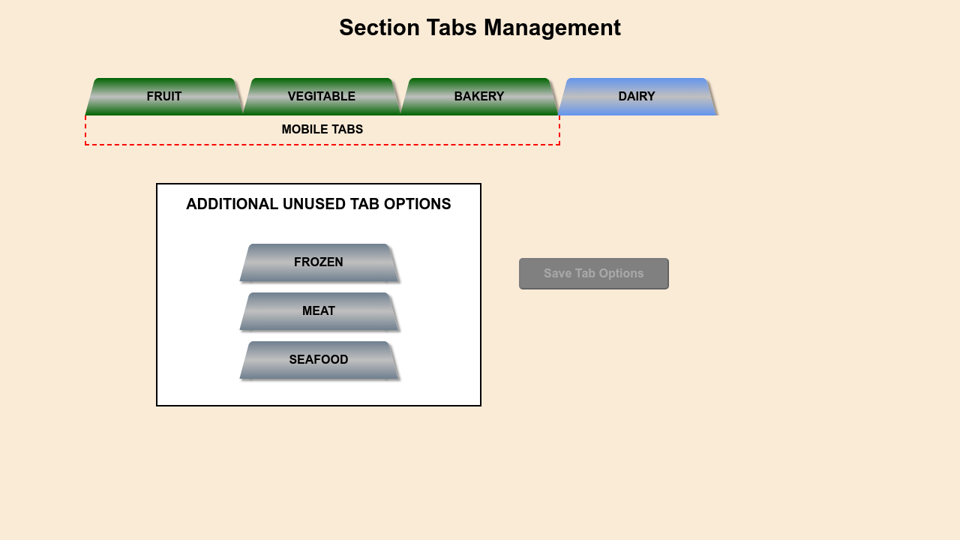

# Drag & Drop 2 - Section Tab Manager

## Purpose

This is an app I created to demonstrate a proof of concept for a former employer. My former employer is a multilingual international company with close to 70 different versions of their website to represent the country the user is coming from. Each country's version of the website could potentially have different types of product offerings which were not always the easiest for their customers to find in the different menus or submenus. I suggested that they create a single search form on the homepage with different tabs that would change the search form for the chosen product offering. I solved and demonstrated this by creating the **_Section Tab Manager_**, a very easy to use tool that allows the marketing department to make changes at their leisure. One of the requirements for the site was to only show three tabs in mobile view, but show up to 5 on larger screen sizes. This is just a POC, so the tab names for demonstration purposes and are not what my former employer uses. To keep the integrity of the production site, a logging table was added to keep track of all changes and by whom.

_This tool is built using the following:_

- JavaScript ES6
- jQuery's _sortable_
- Modular Sass

[Working Demo]http://dragdroptabs.jeffolivier.codes

## How to use this app

**Green tabs** will be shown on only the mobile-sized (whatever you determine) screen widths of your site\
**Blue tabs** will be shown on all screen widths of your site\
**gray tabs** are additional ones that you can add to your menu

- The initial order of the tabs is preset
- Mobile-sized screens will show only 3 tabs (represented as green tabs), and larger screens can show up to 5
- You can rearrange the order of the green and blue tabs
- You can move a tab that is being used (blue and green tabs) to the white box to remove it from being seen/used
- You can add a new tab to your active menu by grabbing a gray one in the white area and moving it inline with the green/blue icons
- The **Save Tab Options** button only becomes **_active_** when there is an actual change to be saved
- You can rearrange the order that the tabs are shown in, then hit **_save_**
- The **_save_** button does not actually save the new order since this is just a demo
- You can not edit the name of each individual tab
- This tool was not designed for use on a mobile device
